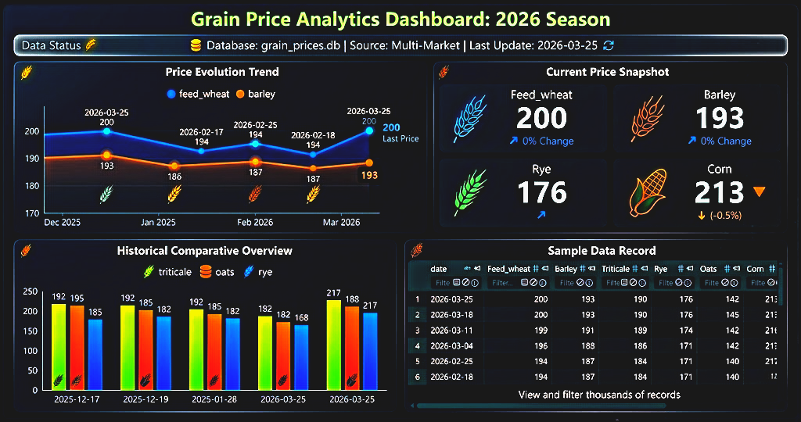

# 🌿 Leon Cereal Price Scraper Project


## 🖼️ Project Snapshot


## 🚀 Overview
This project is focused on scraping, cleaning, and storing weekly cereal prices published by Lonja de Leon.

Main capabilities:
- 🌐 Scrapes historical price tables from multiple URL patterns.
- 🧹 Cleans noisy labels and numeric formats from raw HTML tables.
- 🗃️ Stores structured records in SQLite using SQLAlchemy models.
- 📈 Builds a cleaned dataset with polynomial interpolation for missing values.
- ☁️ Includes a cloud migration step to export data to AWS S3.

## 🧠 What The Project Demonstrates
The implementation showcases practical engineering skills beyond basic scripting:

- 🔍 Resilient web scraping with session handling and user-agent rotation.
- 🧭 Adaptive source discovery when endpoint formats change over time.
- 🧪 Defensive data cleaning for real-world inconsistencies.
- 🧱 Clear data modeling with ORM-based schema design.
- ⚙️ Transaction-safe persistence with rollback handling.
- 📊 Missing-value treatment using polynomial interpolation (`order=3`).

## 🏗️ Current Scraper Workflow
The current workflow in this repository is:

1. `scraper.py` fetches HTML tables from Lonja de Leon pages.
2. `process.py` normalizes row labels and converts prices to float values.
3. `main.py` orchestrates date traversal, domain fallback, and persistence.
4. `models.py` defines the `crop_prices` schema.
5. `database.py` configures SQLAlchemy engine/session/base.
6. `clean_db.py` replaces zero placeholders and generates `crop_prices_clean` using polynomial interpolation.
7. `data_migration_to_s3.py` reads local SQLite data and uploads it to AWS S3.

## 📁 Project Structure
```text
leon-cereal-price-AI/
├── data/
│   └── lonja.db                 # SQLite database file
├── src/
│   ├── clean_db.py              # Interpolation-based cleaning and imputation
│   ├── data_migration_to_s3.py  # Upload pipeline from local DB to AWS S3
│   ├── database.py              # SQLAlchemy engine, session, and Base
│   ├── main.py                  # Scraping orchestration and DB persistence
│   ├── models.py                # ORM model for cereal prices
│   ├── process.py               # Raw-to-clean transformation logic
│   └── scraper.py               # HTTP extraction and HTML table parsing
├── LICENSE
└── README.md
```

## 🧩 Data Model
Raw table: `crop_prices`

- `date` (primary key)
- `feed_wheat`
- `barley`
- `triticale`
- `rye`
- `oats`
- `corn`

Clean table: `crop_prices_clean`

- Same schema as `crop_prices`
- Zero values converted to missing
- Missing values interpolated with polynomial method (`order=3`)

## ⚙️ How To Run
1. Install dependencies in your environment.
2. Run the scraper + storage workflow:

```bash
python src/main.py
```

3. Generate the cleaned/interpolated table:

```bash
python src/clean_db.py
```

4. Run cloud migration to S3:

```bash
python src/data_migration_to_s3.py
```

## ☁️ Cloud (AWS S3)
The project includes a migration utility in `src/data_migration_to_s3.py` to move local SQLite data to S3.

Before running it, configure AWS credentials and region in your environment (for example with `.env` and your local AWS profile).

Expected flow:
- Connect to local SQLite database (`data/lonja.db`).
- Read table data into memory.
- Create bucket if needed.
- Upload dataset to S3 path (`s3://<bucket>/bronze/lonja.csv`).

## 📌 Professional Skills Developed
- ✅ Scraper engineering for semi-structured web sources.
- ✅ Robust scraping strategies for unstable web sources.
- ✅ SQLAlchemy ORM modeling and database session management.
- ✅ Error-tolerant parsing and cleaning for production-like inputs.
- ✅ Interpolation-based imputation for time-dependent price series.
- ✅ Basic cloud data migration workflow to object storage (S3).

## 🔭 Next Technical Steps
- Add unit tests for `clean_data` and `clean_price`.
- Introduce logging levels instead of print-based tracing.
- Add CLI arguments for batch size, start date, and selected domain.
- Add outlier detection before interpolation.

---

Built with focus on scraper robustness, data quality, and maintainable extraction workflows. 🌱
